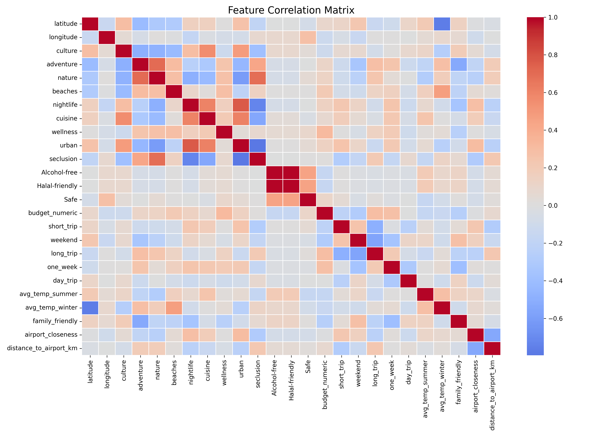
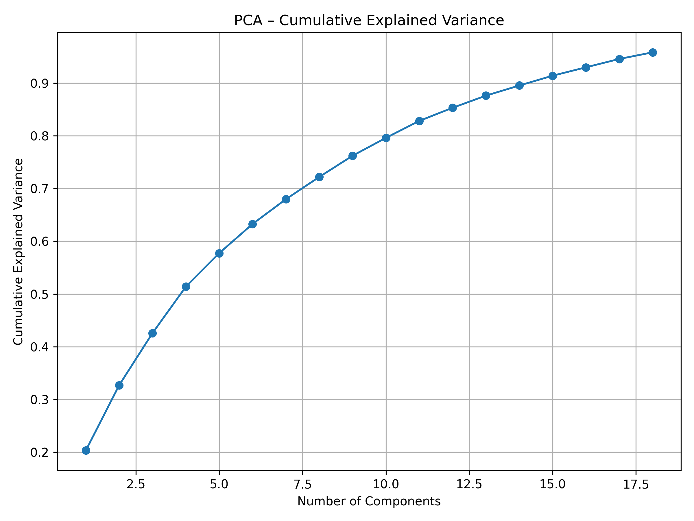
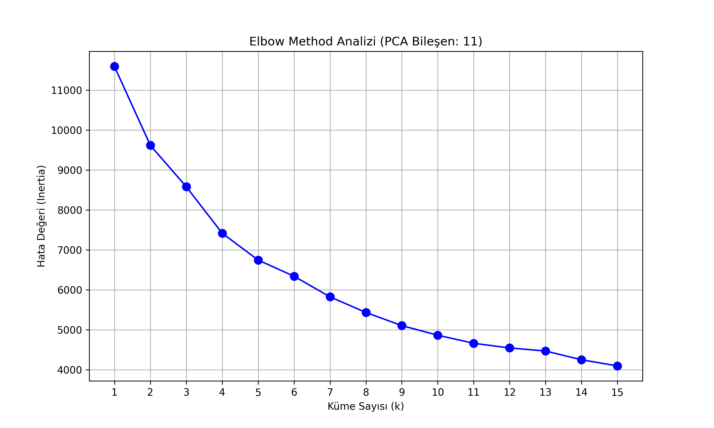

# Smart Travel Planner ✈️

**An AI-powered recommendation system that matches you with destinations based on your preferences.**

Most travel planning tools are just glorified search engines. This project takes a different approach—it uses machine learning to understand your travel style and suggests destinations that actually fit what you're looking for.

## What It Does

The system analyzes weather data, cost patterns, and activity types to calculate similarity scores between your preferences and real destinations around the world.

- **Smart Matching:** Uses Cosine Similarity to find destinations that align with your profile
- **Budget Aware:** Categorizes cities into Economy, Mid-range, and Luxury based on real cost data
- **Activity Based:** Filters by Culture, Adventure, Nature, Nightlife, and Wellness
- **Weather Insights:** Shows actual precipitation and temperature data for each location

---

## The Technical Approach 📈

This isn't rule-based filtering—it's built on statistical analysis and machine learning.

### Feature Correlation Analysis

Before building the model, I analyzed how different features relate to each other. Does adventure correlate with cost? Do cultural destinations have specific weather patterns? The correlation matrix helped identify which features provide independent value and which might be redundant.



*Understanding feature relationships prevents multicollinearity and ensures every input adds meaningful information.*

### Dimensionality Reduction (PCA)

Travel data has a lot of noise. PCA compresses the feature space while keeping the variance that matters. The chart shows how much information each component captures—most of the predictive power comes from the first few dimensions.



*The steep initial curve shows that a few principal components capture most destination characteristics.*

### Clustering Analysis

How many "types" of destinations exist? The Elbow Method answers this by showing where adding more clusters stops improving the model. The graph plots inertia against cluster count—the "elbow" is where returns diminish.



*The curve's plateau indicates the optimal number of destination clusters without overfitting.*

---

## Tech Stack 💻

- **Frontend:** Streamlit
- **Backend:** Flask REST API
- **ML:** Scikit-learn (K-Means, PCA, Cosine Similarity)
- **Data:** Pandas, NumPy
- **Viz:** Matplotlib, Seaborn

---

## Project Structure 📂
```
smart-travel-planner/
├── data/                    # Source data files
├── modules/
│   ├── backend/            # Flask API
│   │   └── app.py
│   ├── frontend/           # Streamlit app
│   │   ├── streamlit_app.py
│   │   ├── data_manager.py
│   │   └── ui_*.py
│   └── ml_nlp/             # ML models
│       ├── feature_engineering.py
│       └── recommendation_system.py
├── output/                 # Generated plots
├── requirements.txt
└── README.md
```

---

## Getting Started 🚀

### Clone the repo
```bash
git clone https://github.com/ecemguven00/smart-travel-planner.git
cd smart-travel-planner
```

### Create virtual environment

**Windows:**
```bash
python -m venv venv
venv\Scripts\activate
```

**Mac/Linux:**
```bash
python3 -m venv venv
source venv/bin/activate
```

### Install dependencies
```bash
pip install -r requirements.txt
```

### Run the app

**Frontend:**
```bash
cd modules/frontend
streamlit run streamlit_app.py
```

**Backend (separate terminal):**
```bash
cd modules/backend
python app.py
```

The app opens in your browser automatically. Backend runs on `http://localhost:5000`.

### Exit
```bash
deactivate
```

---

## How It Works ⚙️

1. Input your preferences (budget, activities, climate)
2. System converts preferences to feature vectors
3. Cosine similarity measures distance to all destinations
4. Results ranked by similarity score
5. Get recommendations with explanations

---

## Future Plans 💡

- Real-time flight API integration
- NLP for natural language input
- Collaborative filtering from user behavior
- Live weather data
- Mobile optimization

---

Built with data science. Designed for travelers.